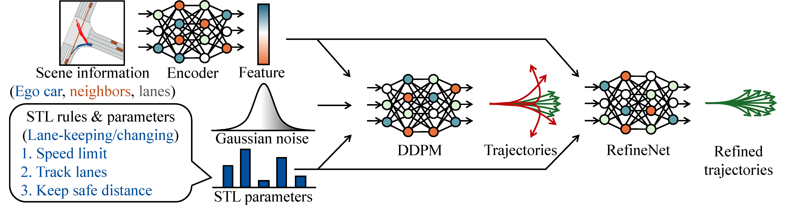
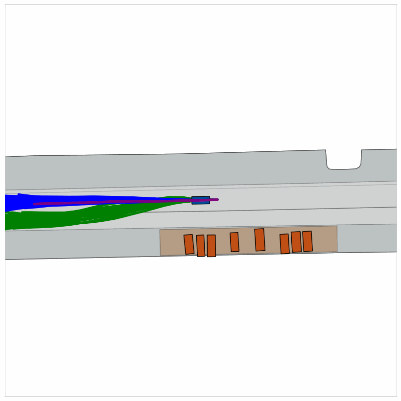

# Diverse Controllable Diffusion Policy with Signal Temporal Logic 

[](https://ieeexplore.ieee.org/stamp/stamp.jsp?tp=&arnumber=10638176)
[](https://2025.ieee-icra.org/)

[Project page](https://mengyuest.github.io/pSTL-diffusion-policy/)

[<ins>Reliable Autonomous Systems Lab @ MIT (REALM)</ins>](https://aeroastro.mit.edu/realm/)

[<ins>Yue Meng</ins>](https://mengyuest.github.io/), [<ins>Chuchu Fan</ins>](https://chuchu.mit.edu/)

> Official implementation for RA-L2024 / ICRA2025 paper, "Diverse Controllable Diffusion Policy with Signal Temporal Logic." [\[link\]](https://ieeexplore.ieee.org/stamp/stamp.jsp?tp=&arnumber=10638176)
> * A GenAI framework to learn diverse and controllable policy for autonomous driving to satisfy Signal Temporal Logic (STL) specifications. 
> * Implemented NuScenes data visualizer and annotation tool (with annotated data) [\[here\]](https://github.com/mengyuest/nuscenes-lane-annotator)



Normal scenario            |  Steer to avoid collision  | Change lane to avoid collision
:-------------------------:|:-------------------------: |:-------------------------:
  |    |  


```
@article{meng2024diverse,
  title={Diverse Controllable Diffusion Policy with Signal Temporal Logic},
  author={Meng, Yue and Fan, Chuchu},
  journal={IEEE Robotics and Automation Letters},
  year={2024},
  publisher={IEEE}
}
```


## Pre-requisite
> Ubuntu 22.04 / 24.04 with GPU (V100; RTX2080Ti / 3090Ti / 4090)

1. Download the NuScenes dataset (follow instructions on [NuScenes website](https://www.nuscenes.org/nuscenes))

2. Set `MY_DATA_DIR` environment variable to the path that contains the `nuscenes` folder

3. Install python packages (via [Conda](https://www.anaconda.com/download))
```
conda create -n pstl_env python=3.7.6
conda activate pstl_env
conda install pytorch==1.13.1 pytorch-cuda=11.7 matplotlib imageio scikit-learn -c pytorch -c nvidia
```

4. Fetch the data and pretrained models from the [google drive](https://drive.google.com/drive/folders/1_5kWWbRzpkZY9np3gECzTOCYVjK4oKX1?usp=sharing).


## (Optional) Data preparation and train the model from scratch
> You can skip this section if use the data and pretrained models from the [google drive](https://drive.google.com/drive/folders/1_5kWWbRzpkZY9np3gECzTOCYVjK4oKX1?usp=sharing).

### Data collection
```
python nusc_train.py -e e0_nusc_cache --collect_data --num_workers 4
```

### Trajectory optimization augmented dataset
```
python nusc_train.py -e e1_nusc_trajopt --trajopt_only 
```

### Our methods
Ours
```
# step-1, train DDPM (with data augmentation)
python nusc_train.py -e e5_ddpm --diffusion --stl_weight 0.0 --load_stlp
# step-2, train RefineNet based on DDPM
python nusc_train.py -e e7_ours --diffusion --stl_weight 0.0 --load_stlp -P e5_ddpm --rect_head --flex --diverse_loss --multi_cands 5
```

### Ablations
Ours (w/o RefineNet) uses DDPM (with data augmentation), which is trained in "Ours" section above

Ours ($\mathcal{L}_{STL}$)
```
python nusc_train.py -e e8_ours_ablation --diffusion --stl_weight 1.0 --load_stlp --load_tj --rect_head --flex -P e5_ddpm --diversity_weight 0.0 --n_shards 4 --interval --multi_cands 5 --diff_full
```

### Baselines
VAE
```
python nusc_train.py -e e2_vae_mono --bc_weight 1.0 --stl_weight 0.0 --load_stlp --vae --flex --gt_data_training
```

VAE (with data augmentation)
```
python nusc_train.py -e e3_vae --bc_weight 1.0 --stl_weight 0.0 --load_stlp --vae --flex --use_init_hint
```

DDPM
```
python nusc_train.py -e e4_ddpm_mono --diffusion --stl_weight 0.0 --load_stlp --gt_data_training
```

\* DDPM (with data augmentation) is trained in "Ours" section

TrafficSim
```
python nusc_train.py -e e6_trafficsim --bc_weight 1.0 --stl_weight 1.0 --load_stlp --vae --flex --collision_loss 1.0
```

\* CTG leverages DDPM model (with data augmentation), which is trained in "Ours" section


## Open-loop test on NuScenes (Table I)

### Our methods

Ours

```
python nusc_train.py -e e7_ours --diffusion --stl_weight 0.0 --load_stlp --rect_head --flex --diverse_loss --multi_cands 5 --test -P e7_ours --run_sampling_test --skip_nusc_load --viz_correct
```

Ours+guidance

```
python nusc_train.py -e e7_ours --diffusion --stl_weight 0.0 --load_stlp --rect_head --flex --diverse_loss --multi_cands 10 --test -P e7_ours --run_sampling_test  --viz_correct --guidance --guidance_before 10 --guidance_niters 1 --guidance_lr 0.01 --n_rolls 3 --other --skip_nusc_load
```

### Ablations
Ours (w/o RefineNet)
```
python nusc_train.py -e e7_ours --diffusion --stl_weight 0.0 --load_stlp --rect_head --flex --diverse_loss --multi_cands 5 --run_sampling_test --test -P e7_ours --skip_nusc_load --viz_correct --no_refinenet
```

Ours ($\mathcal{L}_{STL}$)
```
python nusc_train.py -e e8_ours_ablation --diffusion --stl_weight 1.0 --load_stlp --rect_head --flex --diversity_weight 0.0 --multi_cands 5 --run_sampling_test --test -P e8_ours_ablation --skip_nusc_load --viz_correct
```

### Baselines
VAE
```
python nusc_train.py -e e2_vae_mono --bc_weight 1.0 --stl_weight 0.0 --load_stlp --vae --flex --run_sampling_test --test -P e2_vae_mono --skip_nusc_load --viz_correct
```

VAE (with data augmentation)
```
python nusc_train.py -e e3_vae --bc_weight 1.0 --stl_weight 0.0 --load_stlp --vae --flex --use_init_hint --run_sampling_test --test -P e3_vae --skip_nusc_load --viz_correct
```

DDPM
```
python nusc_train.py -e e4_ddpm_mono --diffusion --stl_weight 0.0 --load_stlp --flex --run_sampling_test --test -P e4_ddpm_mono --skip_nusc_load --viz_correct
```

DDPM (with data augmentation)
```
python nusc_train.py -e e5_ddpm --diffusion --stl_weight 0.0 --load_stlp --flex --run_sampling_test --test -P e5_ddpm --skip_nusc_load --viz_correct
```

TrafficSim
```
python nusc_train.py -e e6_trafficsim --bc_weight 1.0 --stl_weight 1.0 --load_stlp --flex --vae --collision_loss 1.0 --run_sampling_test --test -P e6_trafficsim --other --viz_correct --skip_nusc_load
```

CTG
```
python nusc_train.py -e e5_ddpm --diffusion --stl_weight 0.0 --load_stlp --flex --run_sampling_test --test -P e5_ddpm --skip_nusc_load --viz_correct --guidance
```

## Closed-loop test on NuScenes (Table II)

### Our methods
Ours
```
python nusc_sim.py -e e7_ours --diffusion --stl_weight 0.0 --rect_head --flex --diverse_loss --multi_cands 5 --test -P e7_ours --filter_traj 0 --test_scenes --viz_last --suffix sim
```

Ours+guidance
```
python nusc_sim.py -e e7_ours --diffusion --stl_weight 0.0 --rect_head --flex --diverse_loss --multi_cands 5 --test -P e7_ours --filter_traj 0 --test_scenes --viz_last --guidance --guidance_before 10 --guidance_niters 1 --guidance_lr 0.04 --suffix sim_guide
```

Generate videos
```
python nusc_sim.py -e e7_ours --diffusion --stl_weight 0.0 --rect_head --flex --diverse_loss --multi_cands 5 --test -P e7_ours --filter_traj 0 --test_scenes --guidance --guidance_before 10 --guidance_niters 1 --guidance_lr 0.04 --suffix video
```

### Baselines
VAE (with data augmentation)
```
python nusc_sim.py -e e3_vae --vae --stl_weight 0.0 --use_init_hint --bc_weight 1.0 --flex --test -P e3_vae --filter_traj 0 --test_scenes --viz_last --suffix sim
```

DDPM (with data augmentation)
```
python nusc_sim.py -e e5_ddpm --diffusion --stl_weight 0.0 --flex --test -P e5_ddpm --filter_traj 0 --test_scenes --viz_last --suffix sim
```

TrafficSim
```
python nusc_sim.py -e e6_trafficsim --bc_weight 1.0 --stl_weight 1.0 --flex --vae --collision_loss 1.0 --test -P e6_trafficsim --filter_traj 0 --test_scenes --viz_last --suffix sim
```

CTG
```
python nusc_sim.py -e e5_ddpm --diffusion --stl_weight 0.0 --flex --test -P e5_ddpm --guidance --filter_traj 0 --test_scenes --viz_last --suffix sim_ctg
```
